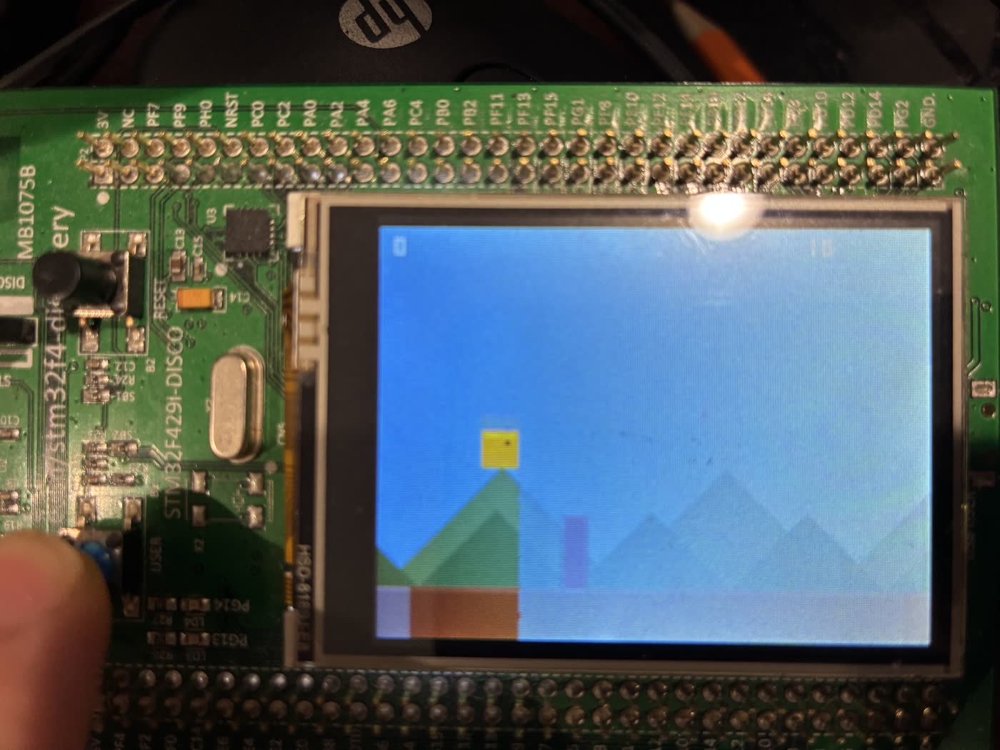

# STM32F429 Jump Game

A 2D side-scrolling jump game for the **STM32F429I-DISC1** Discovery Kit.
为 **STM32F429I-DISC1** 开发板写的 2D 横版跳跃小游戏。



[中文](#中文) · [English](#english)

---

## 中文

纯 C 写的横版跳跃小游戏，跑在 **STM32F429I-DISC1**（探索套件，MB1075）板载的 2.4 寸 TFT 屏上。游戏逻辑自己写，LCD 和 SDRAM 的硬件初始化用 ST 官方 BSP。

### 硬件

- 开发板：**STM32F429I-DISC1**（MCU：STM32F429ZIT6 — Cortex-M4F，180 MHz，2 MB flash，192 KB SRAM + 64 KB CCM）
- 显示：2.4 寸 TFT，240×320，ILI9341 控制器，通过 LTDC 并行 RGB 驱动
- Framebuffer：外部 8 MB SDRAM（IS42S16400J），通过 FMC 连接，地址 `0xD0000000`
- 输入：板载蓝色 **USER (B1) 按键**（PA0）
- 状态指示：绿色 LD3（运行心跳）和红色 LD4（游戏结束）

### 玩法

- 把板子**横过来，USB 接口朝右**，得到 320×240 横屏
- 按 **B1** 起跳
- 支持**二段跳**：空中再按一次 B1 可以再跳一次（垂直速度会被重置，可以临空救一手）
- 障碍的宽度和高度都随机变化。难度（速度 + 生成频率）随分数递增
- 屏幕中央出现红色闪烁条 = 游戏结束，按 B1 重开。最高分掉电前一直保留

### 编译

#### 准备环境（Windows）

```powershell
winget install Kitware.CMake
winget install Ninja-build.Ninja
winget install xpack-dev-tools.openocd-xpack
winget install Arm.ArmGnuToolchain
# 装完 Arm 工具链后手动把它的 bin/ 加到 PATH —— 静默安装不会自动加
```

另外去 https://www.st.com/en/development-tools/stm32cubeprog.html 安装 **STM32CubeProgrammer**（或者只装 ST-Link USB 驱动），让系统能识别板载 ST-Link/V2。

#### 拉取 ST BSP

`vendor/` 已经被 gitignore，第一次构建前先一次性拉取需要的 STM32CubeF4 子集：

```powershell
.\scripts\setup-vendor.ps1
```

脚本会 sparse-clone `Drivers/CMSIS/...`、`Drivers/STM32F4xx_HAL_Driver`、F429I-Discovery BSP、ili9341 组件驱动以及位图字体——大约 110 MB。

#### 构建 + 烧录

```powershell
cmake -S . -B build -G Ninja '-DCMAKE_TOOLCHAIN_FILE=cmake/arm-none-eabi.cmake'
cmake --build build
openocd -f board/stm32f4discovery.cfg -c 'program build/blink.elf verify reset exit'
```

> PowerShell 里 `-D` 参数**必须单引号包起来**，否则会在 `.cmake` 后缀处被切断。

OpenOCD 那个配置名虽然写的是 "stm32f4discovery"，但它通过 SWD 自动识别芯片型号，所以任何 F4 Discovery 板都通用。

### 项目结构

```
.
├── app/
│   ├── main.c                  # 游戏状态、物理、渲染、SystemClock_Config
│   ├── stm32f4xx_it.c          # SysTick + 异常处理 + _init/_fini 桩函数
│   └── stm32f4xx_hal_conf.h    # HAL 配置（沿用 vendor 模板，全模块开启）
├── cmake/arm-none-eabi.cmake   # Cortex-M4 硬浮点工具链定义
├── linker/stm32f429zi.ld       # FLASH 2 MB, RAM 192 KB, CCM 64 KB, SDRAM 8 MB
├── scripts/setup-vendor.ps1    # 一键拉取 ST 厂商代码
├── vendor/                     # setup-vendor.ps1 生成（gitignore）
└── CMakeLists.txt
```

### 实现要点

- **软件旋转。** LTDC 驱动的是面板原生 240×320 竖屏。游戏把屏幕当作 320×240 横屏来用，通过软件 90° 逆时针旋转：横屏坐标 `(lx, ly)` 映射到 framebuffer 偏移 `lx * 240 + ly`。所有绘制都走 [`app/main.c`](app/main.c) 里的 `px()` / `fill_rect()` 辅助函数。
- **像素格式。** BSP 层默认 **ARGB8888**（每像素 4 字节）。Framebuffer 是位于 `SDRAM_DEVICE_ADDR (0xD0000000)` 的 `volatile uint32_t *`。
- **帧率。** 通过帧间 `HAL_Delay(16)` 维持约 60 Hz。每帧先全屏清色（向 SDRAM 写 ~300 KB，约 1.5 ms），再依次重绘视差山脉、地面、障碍、玩家和 HUD 分数。
- **不用 ST 字体。** ST 的 `BSP_LCD_DisplayString` 按原生竖屏渲染，在横屏下会侧着显示。HUD 用了内联在 `main.c` 里的极简 3×5 位图数字字体。
- **时钟。** 配置为 180 MHz SYSCLK，开启 overdrive（PLLM=8，PLLN=360，PLLP=2，来自 8 MHz HSE 晶振），Flash 等待 5 个周期。

### 协议

游戏代码（`app/`、`cmake/`、`linker/`、`scripts/`、`CMakeLists.txt`）以 MIT 协议发布。`vendor/` 下 ST 厂商代码遵循 ST 自己的协议——见各 ST 子模块根目录下的 LICENSE 文件。

---

## English

Bare-metal C with ST's BSP for LCD/SDRAM bring-up, runs directly on the 2.4″ TFT.

### Hardware

- Board: **STM32F429I-DISC1** (MCU: STM32F429ZIT6 — Cortex-M4F, 180 MHz, 2 MB flash, 192 KB SRAM + 64 KB CCM)
- Display: 2.4″ TFT, 240×320, ILI9341 panel driven via parallel RGB through the STM32's LTDC
- Framebuffer: external 8 MB SDRAM (IS42S16400J) connected over FMC, addressed at `0xD0000000`
- Input: blue **USER (B1)** push-button on PA0
- Status LEDs: green LD3 (alive heartbeat) and red LD4 (game over)

### Gameplay

- Hold the board **with the USB connector on the right** for landscape orientation (320×240)
- Press **B1** to jump
- **Double-jump** is enabled: tap B1 again in mid-air to jump a second time (resets vertical velocity, useful for recovery)
- Obstacles vary in both width and height. Speed and spawn rate ramp up with your score
- A red flashing bar in the middle = game over. Press B1 to retry. High score persists until power-cycle

### Building from source

#### Prerequisites (Windows)

```powershell
winget install Kitware.CMake
winget install Ninja-build.Ninja
winget install xpack-dev-tools.openocd-xpack
winget install Arm.ArmGnuToolchain
# After the Arm toolchain install, manually add its bin/ to PATH —
# the silent installer doesn't do it for you.
```

Also install **STM32CubeProgrammer** from https://www.st.com/en/development-tools/stm32cubeprog.html
(or just install the standalone ST-Link USB driver) so the OS recognises the on-board ST-Link/V2.

#### Fetch the ST BSP

The `vendor/` directory is gitignored. Pull the needed pieces of STM32CubeF4 once:

```powershell
.\scripts\setup-vendor.ps1
```

This sparse-clones `Drivers/CMSIS/...`, `Drivers/STM32F4xx_HAL_Driver`, the F429I-Discovery BSP, the ili9341 component driver, and the bitmap fonts — about 110 MB on disk.

#### Build + flash

```powershell
cmake -S . -B build -G Ninja '-DCMAKE_TOOLCHAIN_FILE=cmake/arm-none-eabi.cmake'
cmake --build build
openocd -f board/stm32f4discovery.cfg -c 'program build/blink.elf verify reset exit'
```

> Note: the `-D` argument **must be single-quoted** in PowerShell or it splits at the `.cmake` extension.

The OpenOCD config name says "stm32f4discovery" but it auto-detects the chip over SWD, so it works for any F4 Discovery board including the F429I-DISC1.

### Project layout

```
.
├── app/
│   ├── main.c                  # game state, physics, render, SystemClock_Config
│   ├── stm32f4xx_it.c          # SysTick + fault handlers + _init/_fini stubs
│   └── stm32f4xx_hal_conf.h    # HAL config (vendor template, all modules enabled)
├── cmake/arm-none-eabi.cmake   # cortex-m4 hard-float toolchain definitions
├── linker/stm32f429zi.ld       # FLASH 2 MB, RAM 192 KB, CCM 64 KB, SDRAM 8 MB
├── scripts/setup-vendor.ps1    # one-shot fetch of the vendored ST code
├── vendor/                     # populated by setup-vendor.ps1 (gitignored)
└── CMakeLists.txt
```

### How it works

- **Software rotation.** The LTDC drives the panel in its native 240×320 portrait. The game treats the screen as 320×240 landscape by rotating 90° CCW in software: landscape `(lx, ly)` maps to framebuffer offset `lx * 240 + ly`. All drawing goes through `px()` / `fill_rect()` helpers in [`app/main.c`](app/main.c) that encode this mapping.
- **Pixel format.** The BSP layer defaults to **ARGB8888** (4 bytes/pixel). The framebuffer is `volatile uint32_t *` at `SDRAM_DEVICE_ADDR (0xD0000000)`.
- **Frame rate.** ~60 Hz via `HAL_Delay(16)` between frames. Each frame clears the screen (~300 KB write to SDRAM, ≈1.5 ms) then re-draws the parallax mountains, ground, obstacles, player, and HUD digits.
- **No vendor fonts.** ST's `BSP_LCD_DisplayString` renders in native portrait, which would appear sideways in landscape. The HUD uses a tiny inline 3×5 bitmap font baked into `main.c`.
- **Clock.** Configured for 180 MHz SYSCLK with overdrive (PLLM=8, PLLN=360, PLLP=2 from the 8 MHz HSE). Flash latency 5 wait states.

### License

Game code (everything in `app/`, `cmake/`, `linker/`, `scripts/`, `CMakeLists.txt`) is MIT-licensed. The vendored ST code under `vendor/` is licensed by STMicroelectronics under their own terms — see the LICENSE files in each ST submodule.
